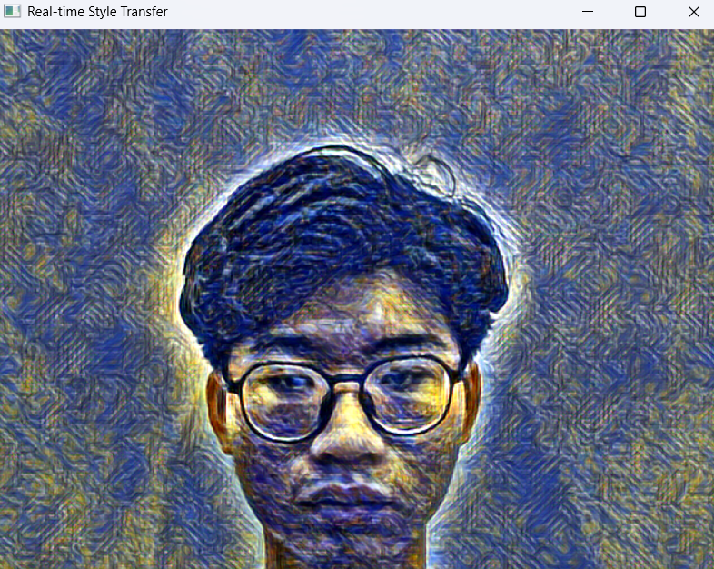

# Real-Time Style Transfer - Real-Time Artistic Image & Video Transformation

## 📌 Overview

This project implements **Fast Style Transfer** for images, videos, and real-time video streams using **deep learning** and **convolutional neural networks (CNNs)**. It is based on the seminal research papers:

- [Image Style Transfer Using Convolutional Neural Networks (Gatys et al., 2016)](https://www.cv-foundation.org/openaccess/content_cvpr_2016/papers/Gatys_Image_Style_Transfer_CVPR_2016_paper.pdf)
- [Perceptual Losses for Real-Time Style Transfer and Super-Resolution (Johnson et al., 2016)](https://arxiv.org/pdf/1603.08155)

The project includes implementations for both **slow NST** and **fast NST**, enabling artistic transformations in **real-time** with a lightweight Transformer Network.

**Streamlit app**: https://realtime-style-transfer.streamlit.app/

<p align="center">
  
  
</p>


## 🚀 Key Features

**1. Slow NST (Original Gatys' Method)**
- Uses VGG-19 to compute content and style losses.
- Works with images and videos.
- Computationally expensive, not suitable for real-time applications.

**2. Fast NST (Perceptual Losses Approach)**
- Trains a Transformer Network for a given style using VGG-16 perceptual loss.
- Significantly faster than slow NST (achieve a ~20x speedup).
- Supports multiple artistic styles (e.g., Post-Impressionism, Cubism, Abstract Impressionism, Digital Painting).

**3. Real-Time Style Transfer**
- Processes live video from a webcam in real-time (GPU acceleration required).

**4. Streamlit Web Application**
- User-friendly interface for image and video style transfer.


## 📁 Project Structure

```bash
Realtime-Style-Transfer/
│── .streamlit/           # Streamlit configuration files
│── resources/            # Resource folder containing images, videos, and styles
│   ├── images/           # Sample content images
│   ├── videos/           # Sample content videos
│   ├── styles/           # Style reference images
│── slowNST_notebook/     # Implementations of traditional (slow) NST
│   ├── imageNST.ipynb    # Slow NST for images
│   ├── videoNST.ipynb    # Slow NST for videos
│── weights/              # Pre-trained TransformerNet model weights
│── app.py                # Streamlit application for fast NST
│── fastNST.ipynb         # Fast NST for images
│── fastNST_video.ipynb   # Fast NST for videos
│── real_time_NST.py      # Real-time NST for live video stream
│── requirements.txt      # Required Python dependencies
│── LICENSE               # License information
│── README.md             # Project documentation
```

## 📜 Implementation Details

⭐ **Slow Neural Style Transfer (NST)**
- Implements the original approach from Gatys et al. (2016).
- Uses VGG-19 to extract content and style representations.
- Optimizes an image iteratively using gradient descent.
- Works well for generating high-quality artistic transformations but is computationally expensive.

⭐ **Fast Neural Style Transfer (Faster & Real-Time)**
- Reference from Johnson et al. (2016): Trains a Transformer Network on a large dataset (COCO2017, 40K images), and use a pre-trained VGG-16.
- Once trained, the model applies style transfer in real-time.
- Achieves a ~20x speedup compared to slow NST.

⭐ **Real-Time Style Transfer on Live Video**
- Uses OpenCV and PyTorch to apply style transfer on a live webcam feed.
- Processes frames in near real-time (depends on GPU capability).
- Enables real-time artistic transformations on video streams.

⭐ **Streamlit Web Application**
- Provides a user-friendly UI for applying style transfer.
- Supports image and video uploads.
- Runs fast NST in real-time with GPU acceleration.

## 🛠 Installation & Usage

**To run the Streamlit webapp**:
```bash
# Clone the Repository
git clone https://github.com/vuthienbao345/Style-Transfer-Realtime.git
cd Realtime-Style-Transfer

# Install Dependencies
pip install -r requirements.txt

# Launch the Streamlit Web App
streamlit run app.py
```

**To run Real-Time Style Transfer on Live Video**:
```bash
python real_time_NST.py
```

## 🎯 Performance & Benchmarks

| Model                           | Processing Time (Image)         | Processing Time (Video 20s, 30FPS)         | 
|--------------------------------|------------|------------|
| Slow NST (Gatys, 2016)         | 5s | 20m  |
| Fast NST (Johnson, 2016)       | 0.25s  | 50s  |

**Note**:
- GPU: NVIDIA Tesla T4 (16GB)
- Dataset: COCO2017 (40K images)

## 🤝 Acknowledgments
If you find this project useful, consider ⭐️ starring the repository or contributing to further improvements!

